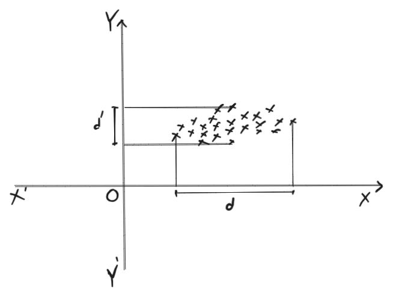
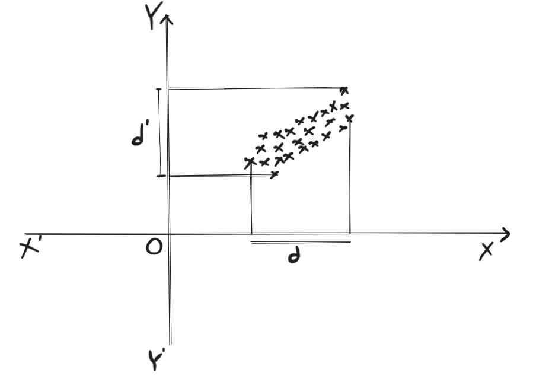
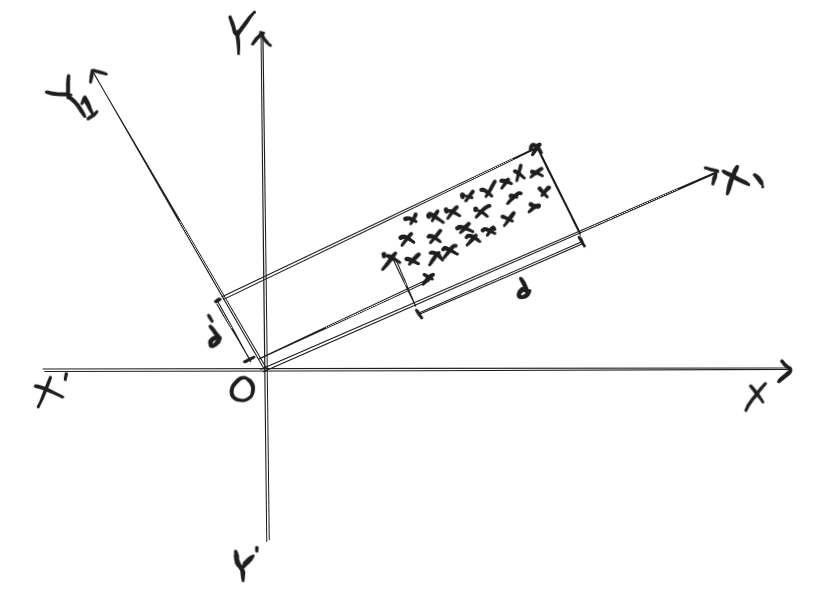
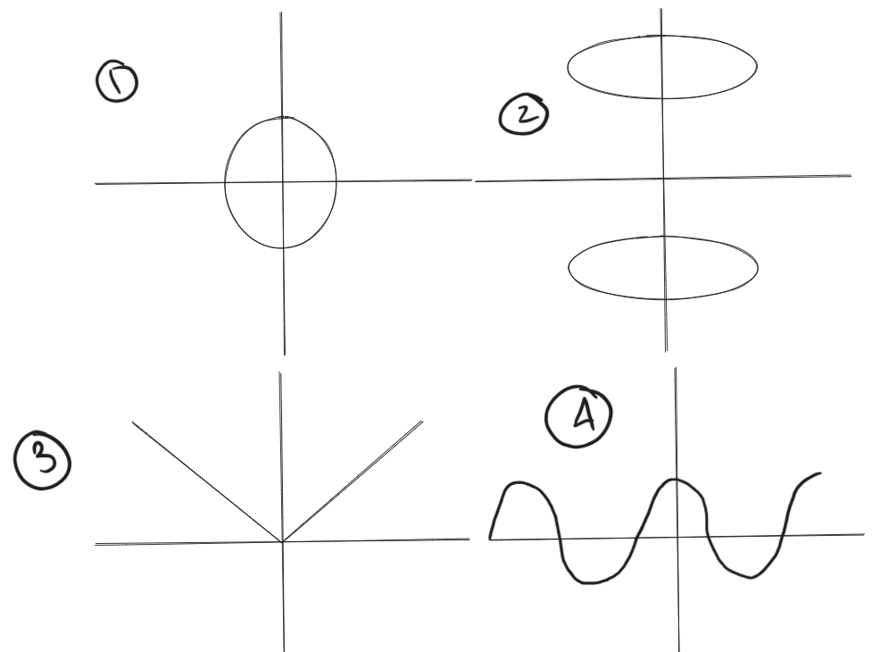

# Principal Component Analysis

## Geometric Intuition of PCA

Before diving into the details of PCA, a feature extraction technique, let's take a look at the how `feature selection` works under the hood.

### A practical example to get started

**A Photographer Taking a Picture in a Stadium**

#### **The Scene**
* A **`stadium`** represents the 3D feature space
* Each **`player`** in the stadium is a **`data point`**
* The **photographer’s task** is to take a **2D photo** (like reducing features or projecting data onto fewer axes).

#### **The Photographer' Goal**
* The photographer wants the **best possible 2D picture** of the players.
* “Best” means:
  * The **players appear well spread out** in the photo (high variance).
  * The **differences between groups of players are clearly visible** (good class separation).
  * The **loss of information from compressing 3D → 2D is minimal**.

This is the same goal as **feature selection**: choose axes (features) that preserve **maximum information**.

#### **The Photographer’s Challenge**

* If the photographer picks a **bad angle**, the players appear **congested** or **overlapping** in the photo.
  * Example: Shooting from directly behind one goalpost, the players look like a **narrow line** → lots of information is lost.
* If the photographer picks a **good angle**, the players are **spread out** across the photo.
  * Example: Shooting from the top corner of the stands, the players’ **positions on the field are clearly visible** → information is preserved.

This is like projecting onto **useful features** that maximize data spread and class distinction.

#### **The Photographer’s Solution**
* Move around the stadium and **try different viewpoints (projections)**.
* Pick the viewpoint where:
  * The **players are maximally spread out** in the photo.
  * The **differences between groups (e.g., defenders, midfielders, attackers)** are **most visible**.

This is exactly what happens in **feature selection**:

* We search for the **best axes (camera angle)** where the data points (players) are **most spread out** and **informative** in the reduced space.

#### **Let's see in geometrically**

For example, a dataset has two features `x` and `y`, and the data points are visualized in a 2D plane as follows:

Here, the projection of the dataset is more spread out in the X-axis than in the Y-axis. This is because the distance between the data points is more informative in the X-axis than in the Y-axis in the 2D plane. If we want to take only one feature, then we can choose the feature, x, due to its higher information content. And thus we can reduce the dimensionality of the dataset from 2 to 1.

In general, if we get projection that is more spread out in one axis than in the other, then we can reduce the dimensionality of the dataset from higher dimensions to lower dimensions.

#### But where the catch lies?

Consider a situation where the projection of the data points seems equally spread out across the axes (like this):

Here, the spread of the projection at the `x-axis` and `y-axis` are d and d' respectively.
And, d and d' are almost same, which means that we cannot reduce the dimensionality of the dataset from higher dimensions to lower dimensions by selecting a feature due to the loss of information as the features contribute almost equally to the spread of the projection.

When all original features contribute almost equally, choosing just one axis would throw away too much information. In such cases, we don’t just select — we create new axes (principal components) by rotating the coordinate system.

In this case, we can reduce the dimensionality of the dataset from higher dimensions to lower dimensions by performing a **Principal Component Analysis** (PCA).

### The Math Behind PCA

The principal components are the axes that maximize the variance of the data while minimizing the variance of the noise where variance is the spread of the data points.

If we able to find the such axis after transforming the data, we can reduce the dimensionality of the dataset from higher dimensions to lower dimensions. As in the following diagram, we have been able to find the axis that maximizes the variance of the data points.

We can see that, now the spread of the data is maximized in the new axis. Therefore, we can reduce the dimensionality of the dataset from higher dimensions to lower dimensions by only taking the newly formed axis with higher variance.

#### But how to transform the data?

Before answering this question, let's first take a look at the concept of **Matrix as a linear transformation**

Before we can find the perfect new axes for our data, we need to understand what matrices **do**. In linear algebra, a matrix isn't just a grid of numbers; it's a function that performs a **linear transformation** on vectors.

A linear transformation has two key properties:
1.  **Lines remain lines:** Straight lines before the transformation remain straight lines after.
2.  **The origin remains fixed:** The point (0,0) maps to (0,0).

Think of a transformation as stretching, squishing, rotating, or shearing the entire space.

**Example: Transforming a Square**
Imagine a simple square defined by its corner vectors. What happens when we apply the matrix `A = [[2, 0], [0, 1]]`?

This matrix has a simple effect:
*   The first component (`x`) is multiplied by 2.
*   The second component (`y`) is multiplied by 1.

This transformation **stretches** the space horizontally. The square becomes a rectangle.

Most vectors change both their direction and magnitude when a transformation is applied. 

But we need to find such transformations that **maximize the variance** of the data points. To do this, we need to find the **eigenvectors** of the **covariance matrix**.

##### **Eigenvectors: The "Unrotated" Vectors**

An **eigenvector** of a linear transformation is a nonzero vector that only gets scaled (stretched or squished) when that transformation is applied to it. It does **not** change its direction (it might point in the exact opposite direction if the scaling factor is negative).

The factor by which it is scaled is called the **eigenvalue**.

**Mathematical Definition:**
For a square matrix `A`, a vector `v` is an eigenvector if:
    `A * v = λ * v`  
Where:
*   `A` is the transformation matrix.
*   `v` is the eigenvector.
*   `λ` (lambda) is a scalar, the eigenvalue.

This equation is the heart of it: applying the transformation `A` to the vector `v` has the exact same effect as just scaling `v` by the value `λ`.

**Why is this so important for PCA?**
In PCA, the transformation we care about is defined by the **covariance matrix**. This matrix encodes how all our data points vary together.
*   The **eigenvectors** of this covariance matrix are the special directions we are looking for—the **Principal Components**. They are the directions in the data that are "pure," meaning the transformation (the covariance structure of the data) only scales them.
*   The **eigenvalues** tell us how much variance (data spread) exists along each of these directions. A large eigenvalue means that its eigenvector is a direction of high variance.

##### **Connecting it All: How Eigenvectors Find the Best Angle**

Let's go back to the photographer in the stadium. The covariance matrix represents the "rules" of how players are positioned on the field.  
*   **Finding the eigenvectors** of this matrix is the mathematical equivalent of the photographer's process of trying every possible camera angle.
*   For each candidate angle (eigenvector), the **eigenvalue** tells the photographer how "spread out" the players would look from that specific angle.
*   The photographer then simply chooses the angle (eigenvector) with the highest "spread score" (eigenvalue). This is **Principal Component 1**.

The next best angle must be perfectly perpendicular to the first (mathematically, eigenvectors of a symmetric matrix are **orthogonal**). This is **Principal Component 2**, and it has the next highest spread score.

This is why eigenvectors are the perfect tool for PCA: they automatically find the axes of maximum variance **and** guarantee that each new axis is uncorrelated with the previous ones, providing a minimal, efficient basis for the transformed data.

### **The Math Behind PCA: How to Transform the Data**

#### **Step 1: Standardize the Data**
Before performing PCA, we must **standardize** the data (subtract the mean, divide by the standard deviation for each feature). This ensures all features are centered around zero and have a unit variance. This is crucial because PCA is very sensitive to the scales of the variables. A feature with a larger scale would dominate the variance calculation and become the principal component by default, even if it's not truly the most informative.

*   **In our stadium analogy:** This is like moving to the exact center of the stadium before the photographer starts looking for angles. It ensures no single direction (like "towards the north goal") is unfairly prioritized just because it's longer.

#### **Step 2: Compute the Covariance Matrix**
The covariance matrix tells us how pairs of features in the dataset vary together. It answers the question: "When one feature changes, how do the others change?"
*   **High positive covariance:** Features increase and decrease together.
*   **High negative covariance:** One feature increases when the other decreases.
*   **Covariance near zero:** Features are linearly independent.

PCA uses this matrix to find the directions where data varies the most.

#### **Step 3: Perform Eigen decomposition**
This is the core mathematical operation. We find the **eigenvectors** and **eigenvalues** of the covariance matrix.
*   **Eigenvectors:** These are the **new axes (principal components)** we are looking for. They are unit vectors that define the direction of the new feature space. The first eigenvector points in the direction of the maximum variance.
*   **Eigenvalues:** These are scalars (numbers) that indicate the **magnitude of the variance** along their corresponding eigenvector. A larger eigenvalue means more variance is captured along that direction.

**Finding the principal components is equivalent to finding the eigenvectors of the covariance matrix.**

#### **Step 4: Sort and Select Principal Components**
We sort the eigenvectors in descending order of their eigenvalues. The eigenvector with the highest eigenvalue is **Principal Component 1 (PC1)**, the next is **PC2**, and so on.

We then decide how many of these top components to keep. This is often done by looking at the **explained variance ratio**—the percentage of total variance each principal component captures. We might keep enough components to capture, say, 95% of the total variance, dramatically reducing dimensionality while losing minimal information.

#### **Step 5: Project the Data Onto the New Axes (Transform)**
Finally, we form a projection matrix from the selected eigenvectors and use it to transform the original data onto the new subspace. This is done via a simple matrix multiplication:

`Transformed_Data = Original_Standardized_Data * Projection_Matrix`

The result is a new dataset with fewer dimensions (the principal components) where the patterns in the original data are preserved as much as possible.

#### **Connecting the Math to the Photographer**

1.  **Standardization:** The photographer stands in the exact center of the stadium.
2.  **Covariance Matrix:** The photographer observes how players' positions are related (e.g., when a defender moves left, the attacker on that side might also move left).
3.  **Eigenvectors:** The photographer mentally rotates and tries every possible 2D camera angle from that center point.
4.  **Eigenvalues:** For each angle, the photographer measures how "spread out" the players appear.
5.  **Selecting PCs:** The photographer chooses the single best angle (PC1). If a 2D photo isn't enough, they also note the second-best angle (PC2), which is perfectly perpendicular to the first, to create a more detailed picture.
6.  **Projection:** The photographer takes the photo from that chosen angle, flattening the 3D scene into an informative 2D image.

### How to Transform a Vector to a New Space

Original Data:
    X = [x1, x2, ..., xn]  
Standardize:
    Z = (X - μ) / σ  (μ = mean, σ = standard deviation)  
      = [x1 - μ1, x2 - μ2, ..., xn - μn] / [σ1, σ2, ..., σn]  
      = [z1, z2, ..., zn]  
      

Covariance Matrix:
    C = (Z^T * Z) / (n - 1)  (n = number of data points)

Eigen Decomposition:
    C * v_i = λ_i * v_i  

Create Projection Matrix:
    W = [v₁, v₂, ..., vₖ] (top k eigenvectors)

Transform: Y = Z * W

### **Finding optimum number of principal components**

Before finding the optimum number of principal components, we need to understand what the eigen values and eigen vectors mean.
Eigen values mean how much variance is captured by each principal component.
And eigen vectors mean the direction of the principal components.

Our target is to find how many principal components we should keep to capture at least 90% of the total variance.

**Mathematical Definition:**

$$
\text{Cumulative Variance} = \sum_{i=1}^k \lambda_i
$$

Where:
*   `k` is the number of principal components.
*   $\lambda_i$ is the eigenvalue of the `i`th principal component.

We want to find the `k` such that the cumulative variance is greater than or equal to 90% of the total variance.

$$
\sum_{i=1}^k \lambda_i \geq 0.9 \times \text{Total Variance}
$$

We can then find the value of `k` that satisfies this condition. 

## **When PCA Fails**

Though PCA is a powerful tool for dimensionality reduction, it can sometimes fail. Here are some common reasons why PCA may fail:

  

1. **Circularly Distributed Data**: If the data is circularly distributed, PCA may fail to capture any meaningful patterns. Since there is no direction with higher variance, so PCA cannot find a meaningful axis to reduce dimensionality—every direction is equally informative.

2. **Separated Clusters of Data**: If the data is separated into clusters and there projection falls into same axis, PCA may fail to capture the overall structure. Since there is no direction with higher variance, so PCA cannot find a meaningful axis to reduce dimensionality—every direction is equally informative.   

Or, Data forms multiple separate clusters, each with its own orientation. PCA, which finds global axes of maximum variance, may not capture the separation between clusters if their main directions differ. Clustering or nonlinear methods may work better.

3. **Data with Special Pattern**: If the data has a special pattern, such as a curve or a wave, PCA may fail to capture the overall structure. Since the data is non-linear, PCA cannot find a meaningful axis to reduce dimensionality due to the projection being linear but the pattern is non-linear.

