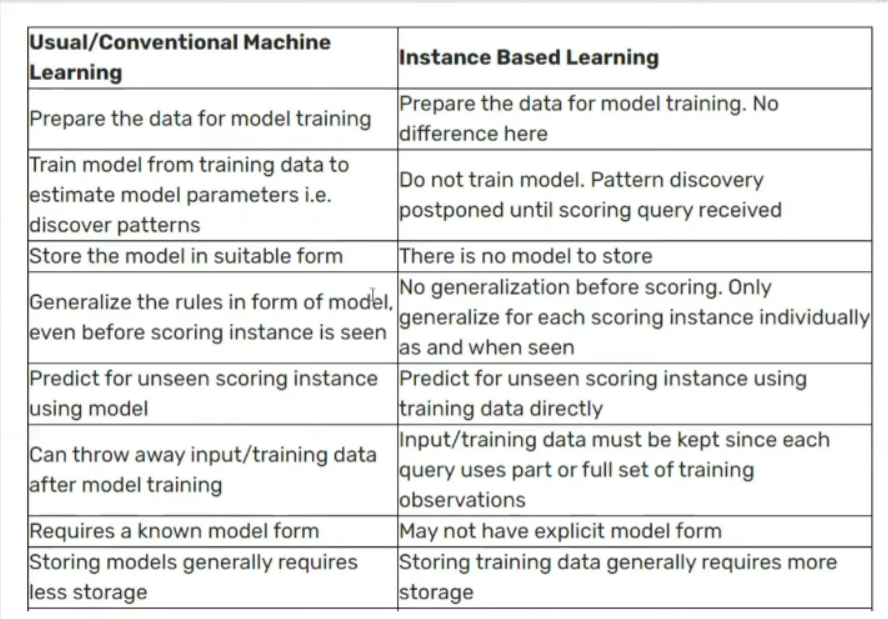

<details>
  <summary>What is Machine Learning</summary>

## Machine Learning  
**Machine learning** is a branch of artificial intelligence that enables computers to learn from data and improve their performance on tasks over time without being explicitly programmed. By using algorithms to analyze patterns in data, machines can make predictions or decisions with minimal human intervention.  

**Example**:  
A popular example of machine learning is email spam detection. The model is trained on a dataset containing labeled emails—some marked as spam and others as not spam. By analyzing patterns in the text, subject lines, and sender information, the model learns to identify characteristics of spam emails. Once trained, it can classify new incoming emails as either spam or not spam, helping users keep their inboxes clean and organized.
</details>

<details>
   <summary>AI vs ML vs DL</summary>

## AI vs ML vs DL
| Aspect                     | Artificial Intelligence (AI)                                              | Machine Learning (ML)                                                                                                                                       | Deep Learning (DL)                                                                                                             |
|----------------------------|---------------------------------------------------------------------------|--------------------------------------------------------------------------------------------------------------------------------------------------------------|------------------------------------------------------------------------------------------------------------------------------|
| **Definition**             | AI is the overall concept of creating intelligent machines that simulate human intelligence and make decisions.                           | ML is a subset of AI focused on algorithms that learn from data patterns without explicit programming.                                                       | DL is a further subset of ML, utilizing neural networks to learn complex patterns from data, inspired by the human brain.      |
| **Learning Process**       | Involves various approaches to simulate intelligence, often including ML and DL techniques.                              | Trains systems on labeled data to identify patterns and relationships, often through supervised learning.                                                   | Uses deep neural networks with multiple layers to extract complex features, can use both supervised and unsupervised learning. |
| **Focus**                  | Building systems that can think, learn, adapt, and make decisions like humans.                                    | Developing algorithms that allow systems to learn from data and make predictions or decisions based on past experiences.                                    | Specializes in identifying complex patterns, particularly in unstructured data like images, text, and sound.                   |
| **Techniques**             | Rule-based systems, decision trees, expert systems, robotics.                                                   | Supervised, unsupervised, and reinforcement learning algorithms.                                                      | Neural networks, including Convolutional Neural Networks (CNNs) and Recurrent Neural Networks (RNNs).                           |
| **Data Requirements**      | Varies; can work with rules or limited data but benefits from larger datasets.                                   | Needs large datasets to generalize and make accurate predictions.                                                      | Requires vast datasets to accurately model complex patterns and relationships.                                                |
| **Computational Power**    | Moderate; often runs on CPUs, sometimes with GPU support.                                                      | Higher than traditional AI, can benefit from GPU support for larger datasets.                                          | Very high; relies on GPUs or TPUs for handling large amounts of data and complex computations.                               |
| **Example in Self-Driving Cars** | Combines outputs from ML and DL to make driving decisions, plan routes, control speed, and interact with passengers.               | Identifies objects on the road, predicts other vehicles’ behavior based on historical data, assists with object detection and obstacle avoidance.           | Recognizes objects in images, analyzes sensor data to detect obstacles and anticipate changes in the environment.              |
| **Real-Life Use Case**     | Virtual assistants (Siri, Alexa), facial recognition, recommendation systems.                                  | Spam detection, credit scoring, product recommendations.                                                              | Self-driving cars, medical imaging analysis, natural language processing.                                                     |
| **Overall Role in AI**     | AI is the broadest category, encompassing ML and DL as methods to achieve intelligent systems.                 | ML is a technique within AI to enable systems to improve based on data without explicit programming.                    | DL is a specialized ML approach effective in handling unstructured data and complex relationships.                            |


</details>

<details>
   <summary>Types of Machine Learning : [ Based on Supervision ] </summary>

## Based on supervision
According to the supervision required, there are mainly four types of machine learning.
- Supervised Learning
  - Classification
  - Regression
- Unsupervised Learning
  - Clustering
  - Dimensionality Reduction
  - Anomaly Detection
  - Association
- Semi-supervised Learning
- Reinforcement Learning

Here’s a brief overview of the four main types of machine learning based on supervision, along with examples for each:
### Supervised Learning
In supervised learning, models are trained on labeled data where the target outcome is known. The goal is to map inputs to outputs.
   - **Classification**: Used to categorize data into predefined classes.
     - **Example**: Spam detection in emails, where emails are classified as "spam" or "not spam."
   - **Regression**: Predicts continuous outcomes based on input variables.
     - **Example**: Predicting house prices based on factors like square footage, location, and age of the house.

### Unsupervised Learning
In unsupervised learning, the model is trained on unlabeled data to identify patterns or groupings within the data.
   - **Clustering**: Groups data into clusters based on similarity.
     - **Example**: Customer segmentation, where customers are grouped by purchasing behavior for targeted marketing.
   - **Dimensionality Reduction**: Reduces the number of features while retaining significant information.
     - **Example**: Principal Component Analysis (PCA) for simplifying high-dimensional datasets like image data.
   - **Anomaly Detection**: Identifies outliers or unusual data points.
     - **Example**: Fraud detection in credit card transactions, where unusual spending patterns may indicate fraud.
   - **Association**: Finds associations or rules in data.
     - **Example**: Market basket analysis in retail, where items frequently bought together are identified (e.g., milk and bread).

### Semi-Supervised Learning
In semi-supervised learning, the model is trained on a small amount of labeled data along with a larger set of unlabeled data, leveraging both to improve performance.
   - **Example**: Image recognition, where only a few images in a dataset are labeled, but the model uses both labeled and unlabeled images to identify objects more accurately.

### Reinforcement Learning
In reinforcement learning, an agent learns to make decisions by interacting with an environment, aiming to maximize cumulative rewards over time.
   - **Example**: Training a robot to navigate a maze, where it receives rewards for reaching certain points and penalties for collisions, learning the optimal path over time.

</details>

<details>
   <summary>Types of Machine Learning : [ Based on Production ] </summary>

## Based on production
Based on production, machine learning models can be categorized as:
- Batch(Offline) Learning
- Online Learning

### Batch (Offline) Learning
**Batch Learning** is a machine learning approach where the model is trained on a fixed, entire dataset at once, typically offline. Once trained, the model is deployed, and it doesn't adapt to new data until it is retrained with an updated dataset. This retraining process happens periodically, not continuously, making it suitable for use cases where data doesn't change frequently.
- **Example**: Predictive maintenance in manufacturing, where a model is trained periodically on historical equipment data to predict when maintenance is needed. The model is retrained periodically based on newly collected data.

### Problems and Disadvantages of Batch Learning

**Large Data Requirement**:
   - **Problem**: Batch learning requires a comprehensive dataset for training, as the model will not adapt until the next retraining cycle. 
   - **Disadvantage**: In scenarios with limited historical data or where patterns are constantly evolving, batch learning may underperform because it lacks the flexibility to learn from new information as it becomes available.

**Hardware Limitations**:
   - **Problem**: Training on a large dataset in one go demands significant computational power, memory, and storage.
   - **Disadvantage**: For organizations with limited hardware resources, this can be prohibitive. Training a complex model on a large dataset can take considerable time and can be too demanding for available hardware, making it inefficient or even impossible without powerful infrastructure.

**Availability and Latency**:
   - **Problem**: Retraining a batch learning model can be time-consuming and may require the model to go offline, causing interruptions in availability.
   - **Disadvantage**: In dynamic environments, the model’s accuracy may degrade quickly between training cycles. This can lead to outdated predictions, as the model may be using old data until the next batch retraining. Additionally, deploying the updated model can introduce latency if real-time model updates are needed.


### Online Learning
**Online Learning** is a machine learning approach where the model is trained incrementally, processing data as it arrives, rather than training on a fixed, complete dataset. The model continuously learns and updates its parameters based on each new data point, making it adaptive to changes in data patterns over time.

### When to Use Online Learning
Online learning is particularly useful in scenarios where:
1. **Data Arrives in a Stream**: Data is generated continuously, such as in real-time systems or IoT devices.
2. **Data Changes Over Time**: Situations where patterns evolve frequently, like in financial markets or user behavior on websites.
3. **Large Datasets**: When data is too large to fit into memory at once, or processing the entire dataset at once would be inefficient.
4. **Real-Time Predictions Needed**: Use cases like recommendation systems, fraud detection, and spam filtering where decisions need to reflect the latest available data.

### How to Implement Online Learning
Online learning can be implemented using models and algorithms that support incremental training. These algorithms update their parameters with each new data instance instead of retraining from scratch. Here are common ways to implement it:

1. **Streaming Algorithms**: Algorithms like Stochastic Gradient Descent (SGD) and certain implementations of linear regression, logistic regression, and neural networks can be used in online mode.
2. **Partial Fit in Scikit-Learn**: In Python's Scikit-Learn library, some models (e.g., `SGDClassifier`, `SGDRegressor`, `MiniBatchKMeans`) have a `partial_fit()` method, allowing incremental updates.
3. **Frameworks for Large-Scale Streaming**: Libraries like Apache Kafka (for data streaming) and TensorFlow Extended (TFX) can be used for large-scale implementations.

### Learning Rate in Online Learning
The **learning rate** in online learning controls how much the model adjusts its weights with each new data point. A high learning rate allows the model to adapt quickly but can lead to instability and overshooting. A low learning rate makes the model’s adjustments more gradual but can be slow to adapt to significant data pattern shifts. Choosing an appropriate learning rate is crucial in online learning, and it’s often beneficial to use a **decaying learning rate** that gradually reduces over time as the model stabilizes.

### Out-of-Core Learning
**Out-of-Core Learning** is a method used to handle datasets that are too large to fit into memory. Online learning is inherently compatible with out-of-core learning, as it processes data in small chunks (or batches). With out-of-core learning, the dataset is loaded in small portions from disk, processed incrementally, and the model updates are saved without needing the entire dataset to be loaded at once. Libraries like Scikit-Learn and Dask support out-of-core learning, making them useful for large data applications.

### Disadvantages of Online Learning
1. **Sensitivity to Noise**:
   - Online learning can overreact to noise in the data, especially with a high learning rate. Each data point impacts the model, so noisy data can lead to inconsistent or inaccurate updates.

2. **Complexity in Model Tuning**:
   - Choosing the right learning rate, handling non-stationary data, and managing model drift require careful tuning and can make online learning challenging to manage and maintain.

3. **Data Order Dependency**:
   - Since each new data point updates the model, the order of data can affect the model's performance, potentially introducing bias if data patterns change over time. This may lead to issues if the early data is unrepresentative of later data patterns.

4. **Memory and Computational Costs for Frequent Updates**:
   - In high-frequency data environments, updating the model in real time can strain computational resources and may require specialized infrastructure for efficient performance.

## Online vs Offline
The differences between offline learning and online learning are as follows:

### **Complexity**
- **Offline Learning**: Less complex, as the model remains constant after initial training.
- **Online Learning**: More complex due to dynamic updates as new data is continuously incorporated.

### **Computational Power**
- **Offline Learning**: Requires fewer computations, typically a one-time batch-based training process.
- **Online Learning**: Requires continuous computational resources since each new data point may trigger model updates.

### **Use in Production**
- **Offline Learning**: Easier to implement and maintain, making it suitable for stable, infrequent updates.
- **Online Learning**: More challenging to implement and manage due to continuous updates and the need for real-time data processing.

### **Applications**
- **Offline Learning**: Ideal for tasks with stable data patterns, such as image classification, where there are minimal sudden changes in data distribution.
- **Online Learning**: Suitable for dynamic fields (e.g., finance, economics, healthcare) where data patterns frequently change, and the model needs to adapt in real time.

### 5. **Tools**
- **Offline Learning**: Supported by widely-used, established tools like Scikit-Learn, TensorFlow, PyTorch, Keras, and Spark MLlib.
- **Online Learning**: Primarily in active research, with specialized tools like MOA, SAMOA, scikit-multiflow, and streamDM for handling streaming data. 

This summarizes key differences, with offline learning being more suitable for static datasets and easier maintenance, while online learning is advantageous in environments with constantly changing data, despite its higher complexity and resource requirements.
</details>

<details>
   <summary>Types of Machine Learning : [ instance-based and model-based ] </summary>

## instance-based and model-based
In machine learning, models can be broadly categorized as **instance-based** and **model-based** learning methods. These categories refer to how the algorithm generalizes from the training data to make predictions.

### Instance-Based Learning
Instance-based learning, also known as **memory-based learning**, involves storing training data instances and making predictions by comparing new data points to these stored instances. Instead of explicitly creating a model, the algorithm uses the stored examples directly to make predictions. It relies heavily on similarity measures, such as Euclidean distance, to identify the closest data points.

- **How It Works**: When a prediction is required, the algorithm finds the most similar instances in the stored dataset and makes a decision based on these similarities (often through a "majority vote" or averaging).
- **Examples**:
  - **k-Nearest Neighbors (k-NN)**: Predicts the label of a new point based on the majority label of its k-nearest neighbors.
  - **Locally Weighted Regression**: Estimates a prediction for a new instance by fitting a local model around that instance using nearby data points.
- **Advantages**:
  - Adaptable to new patterns since it doesn't rely on a fixed model.
  - Simple to understand and implement.
- **Disadvantages**:
  - Computationally expensive at prediction time, as it requires searching through the dataset for each prediction.
  - Sensitive to irrelevant or noisy features, which can distort the similarity measures.

### 2. Model-Based Learning
Model-based learning involves building an explicit model of the data based on the training dataset. The algorithm learns a set of parameters or rules from the training data that represent its general structure, allowing it to make predictions without directly referencing the entire dataset. This approach assumes that there is an underlying relationship in the data that can be captured mathematically.

- **How It Works**: The algorithm fits a model (e.g., a line, curve, or a set of rules) to the training data. After training, the model makes predictions on new data based on this generalized representation.
- **Examples**:
  - **Linear Regression**: Fits a linear relationship between input features and output.
  - **Decision Trees**: Creates a tree structure of decision rules to classify data.
  - **Neural Networks**: Learns a complex, non-linear representation through multiple layers of parameters.
- **Advantages**:
  - Fast predictions, as the model uses learned parameters instead of searching through instances.
  - Can generalize well to new data, especially when the model captures the underlying pattern correctly.
- **Disadvantages**:
  - Requires careful tuning and may not perform well if the model is overly simplistic or too complex (overfitting).
  - Less adaptable than instance-based learning for new or changing patterns unless retrained.

In summary:
- **Instance-Based Learning** is useful when data is relatively simple and a local approach works best. However, it can be computationally intensive.
- **Model-Based Learning** is ideal when the data has an underlying pattern that can be effectively captured by a mathematical model, making it faster for predictions and more scalable.



</details>

<details>
   <summary>Challenges in Machine Learning</summary>

## Challenges in Machine Learning
- **Data Collection**: Collecting a large and relevant dataset is essential for building effective machine learning models. Insufficient or incorrect data can significantly impact model performance.
- **Insufficient Data/Labeled Data**: Many machine learning algorithms require large amounts of labeled data to perform well, which can be costly and time-consuming to acquire.
- **Non-Representative Data**: The dataset must represent the real-world scenario where the model will be applied. Non-representative data can lead to biased models that perform poorly on unseen data.
- **Poor Quality Data**: Noise, outliers, and missing values in the dataset can negatively affect the model's ability to learn patterns effectively.
- **Irrelevant Features**: Including irrelevant features (or not selecting the most informative ones) can make the model more complex and reduce its accuracy.
- **Overfitting**: When a model learns the training data too well, capturing noise as if it were a genuine pattern, it may fail to generalize to new data.
- **Underfitting**: A model that is too simple may fail to capture the underlying patterns in the data, resulting in poor performance on both training and test data.
- **Software Integration**: Integrating machine learning models into existing software systems or workflows can be challenging, especially when dealing with production environments.
- **Offline Learning/Deployment**: Batch (offline) learning models require periodic retraining with new data, which can be time-consuming and resource-intensive.
- **Cost Involved**: Building, training, and deploying machine learning models can require significant financial and computational resources, especially when working with large datasets or complex models.
</details>

<details>
  <summary>Application of Machine Learning</summary>

## Application
we will see the application of machine learning in B2B and B2C contexts:

### B2B Applications of Machine Learning
1. **Supply Chain Management**: Machine learning optimizes inventory levels, predicts demand, and enhances logistics efficiency. It helps businesses like Walmart streamline operations and reduce costs.
2. **Customer Relationship Management (CRM)**: ML algorithms help in personalizing marketing campaigns, predicting customer churn, and improving customer satisfaction. Salesforce, for example, uses ML to provide insights and automate tasks.
3. **Cybersecurity**: ML detects anomalies, identifies threats, and enhances data security. IBM and other cybersecurity firms use ML to provide advanced threat protection for businesses.
4. **Financial Services**: In B2B banking, ML assists in fraud detection, credit risk assessment, and investment forecasting. Companies like Bloomberg use ML for predictive analytics.
5. **Manufacturing**: ML is used in predictive maintenance, quality control, and process optimization. Siemens leverages ML to monitor equipment health and optimize production lines.

### B2C Applications of Machine Learning
1. **Retail**: Machine learning powers product recommendations, optimizes pricing, and personalizes the shopping experience for users. For example: Amazon
2. **Banking and Finance**: ML is employed for fraud detection, credit scoring, and personalized financial advice, making transactions more secure and services more tailored.
3. **Transport**: Machine learning optimizes route planning, predicts demand, and improves ride-sharing efficiency to provide better customer experiences. For example: OLA
4. **Manufacturing**: Tesla uses ML for autonomous driving, predictive maintenance, and improving vehicle safety by analyzing sensor data and driver behavior. For example: Tesla
5. **Consumer Internet**: ML helps in content recommendation, spam detection, and trend analysis, ensuring a more personalized and secure experience for users. For example: Twitter

</details>

<details>
  <summary>Machine Learning Development Life Cycle (MLDLC)</summary>

## MLDLC
MLDLC is a framework for developing machine learning models in a structured and systematic way. It includes several steps, from problem definition to deployment, that are focused to build robust, accurate, and scalable machine learning models.

Here’s a step-by-step guide to solving a machine learning problem using the Machine Learning Development Cycle (MLDC), illustrated with an example of predicting house prices:

### 1. **Frame the Problem**
   - **Objective**: Define the problem, goals, and performance metrics.
   - **Example**: Suppose we want to build a model that predicts house prices based on features like bedrooms, bathrooms, and location. The goal is to create a model that accurately predicts the price, using metrics like Mean Squared Error (MSE) to evaluate performance.

### 2. **Data Collection**
   - **Objective**: Collect relevant data from various sources.
   - **Example**: For predicting house prices, data can be sourced from real estate websites, public datasets, or web scraping tools to obtain information on home features and sale prices.  
  
(Data can be in csv format, or can be collected using API, web scraping, database to data ware house via ETL.)

### 3. **Data Preprocessing**
   - **Objective**: Clean and prepare data for modeling.
   - **Example**: Remove duplicate values, remove rows with missing values, encode categorical features like location using encoding, and scale numerical features like square footage and lot size to standardize them, remove outliers.

### 4. **Exploratory Data Analysis (EDA)**
   - **Objective**: Understand the data distribution and relationships among features.
   - **Example**: Visualize relationships using scatter plots (e.g., between square footage and price) and histograms to see the distribution of features and identify patterns that influence house prices.
  
(visualization, univariate, bi-variate, multivariate, outlier detection, imbalance -> balance)

### 5. **Feature Engineering and Selection**
   - **Objective**: Create and select features that improve model performance.
   - **Example**: Create new features like “house age” or “bathroom-to-bedroom ratio.” Use correlation analysis or feature importance scores to select the most impactful features for predicting prices.

### 6. **Model Training, Evaluation, and Selection**
   - **Objective**: Train models, evaluate their performance, and select the best one.
   - **Example**: Train models like Linear Regression and Decision Tree Regression. Evaluate them using metrics such as MSE or R-squared, and select the model with the best performance based on these metrics.

### 7. **Model Deployment**
   - **Objective**: Deploy the model in a production environment.
   - **Example**: Deploy the house price prediction model on a website or app where users can input house features and receive a predicted price.

### 8. **Testing and Optimization**
   - **Objective**: Continuously test and optimize the model in production.
   - **Example**: Regularly test the model on new data to ensure accuracy. If performance drops, retrain or update the model with new data or features to improve accuracy.

By following these steps, we can systematically build, deploy, and maintain a machine learning model that solves real-world problems effectively.
</details>

<details>
   <summary>Working with CSV files</summary>

## Working with CSV files

Now, discussion time for working with ``CSV`` file in details.

### 0. Importing pandas
To import import pandas:
```python
import pandas as pd
```
### 1. Opening a Local CSV File
Load a CSV file from a local directory:
```python
df = pd.read_csv('path/to/file.csv')
```

### 2. Opening a CSV File from a URL
If the CSV is hosted online, we can directly load it using the URL:
```python
import requests
from io import StringIO
import pandas as pd

url = "https://raw.githubusercontent.com/cs109/2014_data/master/countries.csv"
headers = {"User-Agent": "Mozilla/5.0 (Macintosh; Intel Mac OS X 10.14; rv:66.0) Gecko/20100101 Firefox/66.0"}

# Perform the GET request with custom headers
req = requests.get(url, headers=headers)

# Check if the request was successful
if req.status_code == 200:
    data = StringIO(req.text)  # Read the text content as a file-like object
    df = pd.read_csv(data)
    print(df.head())
else:
    print(f"Failed to retrieve data. HTTP Status code: {req.status_code}")
```
### 3. `names` Parameter
If the file doesn’t contain column headers, to read the CSV file we can set ``header=None`` and use ``names`` to specify the column names:
```python
import pandas as pd

# Custom column names
column_names = ['Country', 'Population', 'GDP']

# Load the CSV without header and assign custom column names
df = pd.read_csv('file.csv', header=None, names=column_names)
print(df.head())
```
Even if the CSV has headers, we can override them with names:
```python
df = pd.read_csv('file.csv', names=['A', 'B', 'C'], header=0)
```
Here, ``header=0`` tells pandas to skip the first row as a header and use the ``names`` list instead.  

**Notes**  
- The number of names in names should match the number of columns in the data (or the subset specified by usecols).
- If names is specified without ``header=None``, pandas still loads the original header row as data in the first row.

### 4. `sep` Parameter (Delimiter)
To specify a custom delimiter, such as a semicolon (`;`), use the `sep` parameter:
```python
df = pd.read_csv('file.csv', sep=';')
```
This is especially useful for non-standard delimited files like `.tsv` files.

**Some more delimiter:**
- Tab-Separated Files: ```df = pd.read_csv('file.tsv', sep='\t')```
- Space-Separate Files: ```df = pd.read_csv('file.txt', sep=' ')```
- Multiple Character Delimiters(like ::) : ```df = pd.read_csv('file.txt', sep='::', engine='python')```
  - **Note**: When using multi-character separators, we must set engine='python', as the default c engine only supports single-character delimiters.
- Whitespace as Delimiter: ```df = pd.read_csv('file.txt', sep='\s+', engine='python')```

### 5. `index_col` Parameter (Index Column)  
The ``index_col`` parameter in ``pandas.read_csv()`` specifies which column(s) should be used as the index of the resulting DataFrame. By default, pandas creates a numeric index starting at 0, but using ``index_col`` can be helpful when the data already contains a column that uniquely identifies each row, such as an ID column.
```python
df = pd.read_csv('file.csv', index_col='ColumnName')
```

### 6. `header` Parameter (Row to Use as Header)
Select a specific row as the header:
```python
df = pd.read_csv('file.csv', header=1)  # Second row as header (0-based index)
```
If dataset does not have a header row, we can use `header=None` to prevent pandas from treating the first row as headers.  
By default, pandas use ``header=0`` i.e., first row as the header.

### 7. `usecols` Parameter (Loading Specific Columns)
To load only the columns we need:
```python
df = pd.read_csv('file.csv', usecols=['Col1', 'Col2'])
```

### 8. `squeeze` Parameter (Single Column as Series)
If loading a single column, use `squeeze=True` to load it as a Series instead of a DataFrame:
```python
series = pd.read_csv('file.csv', usecols=['SingleColumn'], squeeze=True)
```

### 9. `skiprows` Parameter (Skipping Rows)
Skip specific rows at the start of the file, such as for files with metadata at the top:
```python
df = pd.read_csv('file.csv', skiprows=4)
```

### 10. `nrows` Parameter (Number of Rows to Read)
Read only a specific number of rows:
```python
df = pd.read_csv('file.csv', nrows=500)
```
This is useful when previewing a large dataset.

### 11. `encoding` Parameter (Character Encoding)
Specify the character encoding if the file contains non-ASCII characters:
```python
df = pd.read_csv('file.csv', encoding='ISO-8859-1')
```
If we encounter errors related to special characters, try `encoding='utf-8'`.

### 12. `error_bad_lines` Parameter (Skip Bad Lines)
Skip lines that cannot be parsed, often due to inconsistent columns:
```python
df = pd.read_csv('file.csv', error_bad_lines=False)
```
This parameter can help load data from poorly structured files. However, we should use it carefully, as it may result in loss of data.

### 13. `dtype` Parameter (Setting Data Types)
Assign specific data types to columns:
```python
df = pd.read_csv('file.csv', dtype={'col1': 'int64', 'col2': 'float64'})
```
This is useful to ensure correct data types, prevent memory overuse, and avoid data type conversion issues later.

### 14. Handling Dates (`parse_dates` and `infer_datetime_format`)
Automatically parse columns as dates:
```python
df = pd.read_csv('file.csv', parse_dates=['DateColumn'])
```
With `infer_datetime_format=True`, pandas tries to infer the date format, improving performance.
```python
df = pd.read_csv('file.csv', parse_dates=['DateColumn'], infer_datetime_format=True)
```

### 15. `converters` Parameter (Custom Data Conversion)
Apply custom functions to transform values in specific columns:
```python
df = pd.read_csv('file.csv', converters={'ColumnName': lambda x: x.upper()})
```
This is useful for pre-processing data without additional post-processing steps.

### 16. `na_values` Parameter (Custom Missing Values)
Specify custom representations of missing values:
```python
df = pd.read_csv('file.csv', na_values=['N/A', 'missing'])
```
By default, pandas treats blank fields as NaN, but this can be extended to custom indicators.

### 17. Loading Large Datasets in Chunks (`chunksize`)
For very large files, use `chunksize` to read the file in parts:
```python
chunk_iter = pd.read_csv('file.csv', chunksize=10000)
for chunk in chunk_iter:
    # Process each chunk
    process(chunk)
```
This is memory-efficient and useful for handling files that are too large to fit in memory at once.

### 18. `low_memory` Parameter (Efficient Loading)
If we’re loading a large file with mixed types in columns, avoid dtype guessing with `low_memory=False`:
```python
df = pd.read_csv('file.csv', low_memory=False)
```
This can prevent type inference errors and allow consistent data types in columns.

### 19. `comment` Parameter (Skip Comments)
Skip lines starting with a specified character, such as `#`:
```python
df = pd.read_csv('file.csv', comment='#')
```
Useful for CSV files with comment lines.

### 20. `skipfooter` Parameter (Skipping Footer Rows)
If the file has a footer, skip rows from the end:
```python
df = pd.read_csv('file.csv', skipfooter=2, engine='python')
```
This is especially useful when working with CSVs that include summary data at the end.

### 21. `thousands` Parameter (Handling Thousand Separators)
Specify the thousands separator for numerical values:
```python
df = pd.read_csv('file.csv', thousands=',')
```
This helps correctly load numbers with separators, such as "1,000,000".

### 22. `memory_map` Parameter (Using Memory Mapping for Faster Loading)
Enable memory mapping to speed up reading of large files:
```python
df = pd.read_csv('file.csv', memory_map=True)
```
This is particularly useful on systems with limited memory.

</details>

<details>
   <summary>Working with JSON files</summary>

## Working with JSON files

---

### **1. Opening a Local JSON File**
To load a local JSON file into a pandas DataFrame, use `pd.read_json()` with the file path.

```python
import pandas as pd
import json

# Writing a sample JSON file
data = {
    "Name": ["Alice", "Bob", "Charlie"],
    "Age": [25, 30, 35],
    "Country": ["USA", "Canada", "UK"]
}
with open("data.json", "w") as f:
    json.dump(data, f)

# Reading the JSON file
df = pd.read_json("data.json")
print(df)
```
---

### **2. Opening a JSON File from a URL**
We can directly load JSON data from an online source using `pd.read_json()` with the URL.

```python
url = "https://api.github.com/repos/pandas-dev/pandas/issues?per_page=5"
df = pd.read_json(url)
df.head()
```

---

### **3. `orient` Parameter**
The `orient` parameter specifies the structure of the JSON data. It determines how the JSON is interpreted and converted into a DataFrame or Series.

#### Common Options:
- **`split`**: Dictionary with keys `index`, `columns`, and `data`.
- **`records`**: List of dictionaries (each dictionary represents a row).
- **`index`**: Dictionary of dictionaries (keys are row indices).
- **`columns`**: Dictionary of lists (keys are column names).
- **`values`**: A 2D array.

```python
# using split
data = '{"columns":["Name","Age"],"data":[["Alice",25],["Bob",30]]}'
df = pd.read_json(data, orient="split")
df
```

```python
# using records
data = '[{"Name": "Alice", "Age": 25}, {"Name": "Bob", "Age": 30}]'
df = pd.read_json(data, orient="records")
print(df)
```

---

### **4. `typ` Parameter**
The `typ` parameter specifies whether to return a DataFrame or a Series:
- **`"frame"`**: Returns a DataFrame (default).
- **`"series"`**: Returns a Series.

```python
data = '{"Name": ["Alice", "Bob"], "Age": [25, 30]}'
series = pd.read_json(data, typ="series")
print(series)
```

---

### **5. `dtype` Parameter**
The `dtype` parameter allows to specify the data type of columns in the resulting DataFrame.

```python
data = '{"Name": ["Alice", "Bob"], "Age": ["25", "30"]}'
df = pd.read_json(data, dtype={"Age": int})
print(df)
```

---

### **6. Convert Axes**
The `convert_axes` parameter specifies whether to convert the axes of the DataFrame or Series to pandas-compatible types.

---

### **7. Convert Dates**
If `convert_dates=True`, pandas will attempt to parse date strings into `datetime` objects.

```python
data = '{"Date": ["2024-01-01", "2024-01-02"], "Value": [10, 20]}'
df = pd.read_json(data, convert_dates=True)
print(df)
```

---

### **8. `keep_default_dates`**
If `False`, pandas will skip automatic date conversion. Use this if dates in the data are not in a standard format or if they should remain as strings.

---

### **9. `precise_float`**
When working with floating-point numbers, setting `precise_float=True` improves the precision during parsing.

```python
data = '{"Value": [0.12345678912345678, 0.98765432198765432]}'
df = pd.read_json(data, precise_float=True)
print(df)
```

---

### **10. `date_unit`**
Defines the time unit for parsing dates, e.g., `ms` (milliseconds), `s` (seconds).

```python
data = '{"Date": [1609459200000, 1609545600000]}'
df = pd.read_json(data, convert_dates=True, date_unit="ms")
print(df)
```

---

### **11. Encoding**
Use the `encoding` parameter to specify the file encoding, e.g., `utf-8`, `latin1`.

---

### **12. `lines`**
If the JSON file contains line-delimited JSON objects (one object per line), use `lines=True`.

```python
data = '{"Name": "Alice", "Age": 25}\n{"Name": "Bob", "Age": 30}'
df = pd.read_json(StringIO(data), lines=True)
print(df)
```

---

### **13. `chunksize`**
For large JSON files, load the data in chunks to avoid memory overload.

```python
for chunk in pd.read_json("large_file.json", chunksize=1000):
    print(chunk.head())
```

---

### **14. Compression**
Supports compressed JSON files (e.g., `gzip`, `bz2`, `zip`, `xz`).

```python
df = pd.read_json("compressed_file.json.gz", compression="gzip")
```

---

### **15. `nrows`**
Load only the first `n` rows of the file. Useful for quickly inspecting a dataset.

```python
df = pd.read_json("large_file.json", nrows=100)
```

---

### **16. Engine**
Specifies the parser engine. Commonly used options:
- `"python"`: The Python-based parser (slower, but handles more complex cases).
- `"c"`: The C-based parser (faster).

```python
df = pd.read_json("data.json", engine="c")
```

---

</details>

<details>
   <summary>Basic Questions to be asked toward a dataset</summary> 

## Basic Questions to ask

### How big is the data?

```python
# To know the dimensions of the dataset
df.shape
# To know only the number of rows
df.shape[0]
# To know only the number of cols
df.shape[1]
```

### How does the data look like? 

```python
# To see the first 5rows of the dataset
df.head()
# To see the last 5rows of the dataset
df.tail()
# To see any random 5rows of the dataset
df.sample(5)
```

### What is the data types of the columns?
```python
# To see the column name, non-null count, and data type
df.info()
```

### Are there any missing values?
```python
# To count the number of missing values in each column
df.isnull().sum()
# To see the percentage of missing values in each column
(df.isnull().sum()/df.shape[0])*100
``` 

### How does the data look mathematically?
```python
df.describe()
``` 

### Are there duplicated values?
```python
# To see the number of duplicate rows
df.duplicated().sum()
``` 

### How is the correlation between cols?
```python
# To see the correlation of all column with a specific columns named 'colName'
df.corr()['colName']
``` 

</details>